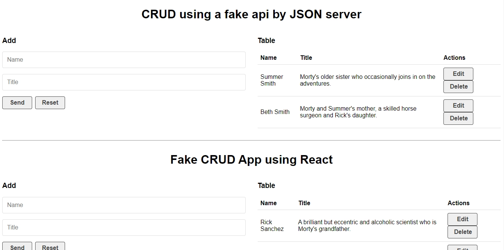

# CRUD API - CRUD IMPLEMENTATION PRACTICE USING REACT

This is a practice for consuming REST APIs using React, involving a hardcore DB initially and then a JSON DB that works with JSON server.

## Table of Contents

- [Overview](#overview)
   - [The Challenge](#the-challenge)
   - [Screenshot](#screenshot)
   - [Links](#links)

- [My Process](#my-process)
   - [Built With](#built-with)
   - [What I Learned](#what-i-learned)

- [Author](#author)

## Overview

### The Challenge

Build a React web application that performs basic CRUD operations on a hardcoded DB and a fake API using json server. Both the DB and the Fake API contain characters from the Rick and Morty show along with their descriptions.

### Project Requirements (as stated by Codecademy):

- Install and set up json-server functionality.
- Use HTML, CSS, and JavaScript as part of the tech stack.
- Utilize version control with Git and host the repository on GitHub.
- Write a README (using Markdown) that documents your project, including:
   - The project's purpose.
   - Technologies used.
   - Features.
   - Plans for future development.

#### Features

- The web app using a fake API allows data persistence when the fake JSON-server is properly loaded.
- Users can navigate through the website's content by scrolling.
- Users can create and populate the DB with characters from the Rick and Morty show.
- Users can view existing playlists, select one, and modify its name or add new songs by removing existing songs displayed in the Playlist.jsx component.

#### Prerequisites

- HTML
- CSS
- JavaScript
- React
- Git and GitHub
- HTTP Requests and Responses
- JSON server

### Screenshot

### Links

- Solution URL: [GitHub Repository](https://github.com/light-roast/crudapp)

## My Process

### Built With

- JSON server: type `npm run fake-api` to load the fake server with the JSON database.
- Semantic HTML5 markup
- Custom CSS properties
- [React](https://reactjs.org/) - JavaScript library
- Vite React Create -> Runs with `npm run dev`
- The `.env` file is ignored by Git and contains the API key. To use this project, you need to create your own API key at Yelp, store it in the root `.env` file, and follow this pattern: `VITE_API_KEY="Bearer api-key-here"`

### What I Learned

I had the opportunity to practice the implementation of basic CRUD in a React Web App. I also learned how JSON Server helps simulate an API with access and manipulation of a persistent DB, which is pretty useful. To use JSON server, I wrote a helper function in helphttp.js that allowed me to understand how an API receives REST methods and handles them.

## Author

- Website: [Daniel Echeverri Llano](https://light-roast.github.io/portafolio/)
- Frontend Mentor: [@light-roast](https://www.frontendmentor.io/profile/light-roast)
- Twitter: [@echeverri_llano](https://www.twitter.com/echeverri_llano)
